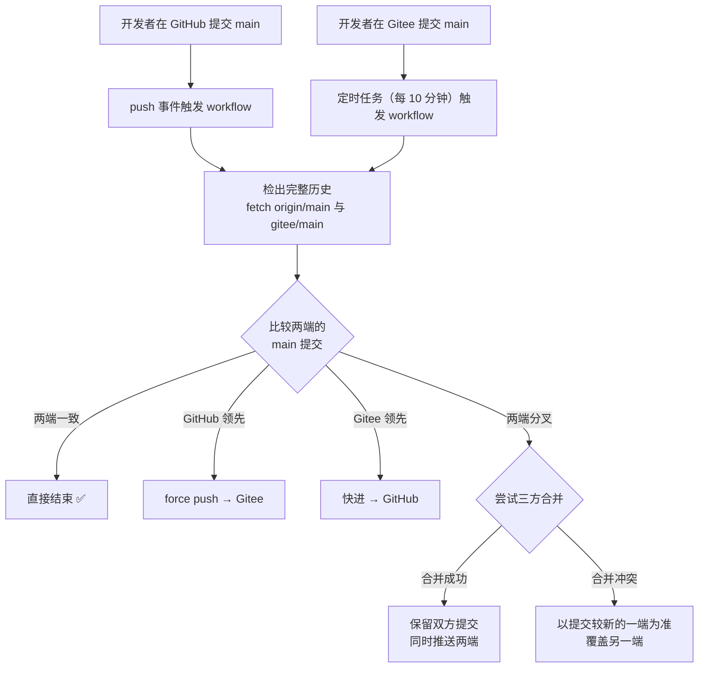

# GitHub ⇄ Gitee 双向同步机制

本仓库同时托管在 GitHub 与 Gitee，两端内容始终保持一致。任一端有新提交，都会在无需人工干预的情况下同步到另一端。

## 一、整体机制

同步完全由仓库内置的 GitHub Actions workflow 驱动，**不需要自建服务器、不需要 Gitee 付费镜像功能**。

两条触发路径对应两种延迟：

| 触发路径 | 触发方式 | 生效延迟 |
| --- | --- | --- |
| GitHub → Gitee | `push` 事件 | 秒级（Actions 排队时间，通常 10–60 秒） |
| Gitee → GitHub | `schedule` 定时（每 10 分钟） | 最长约 10 分钟（GitHub 高峰时可能再延迟几分钟） |

> 之所以 Gitee 侧要靠定时任务：Gitee 的 WebHook 无法携带 GitHub API 所需的认证请求头，因此不能直接唤起 GitHub Actions。定时拉取是**不依赖第三方中转服务**的前提下最稳妥的做法。

## 二、同步行为矩阵

workflow 每次都先比对两端，再决定动作。**GitHub 侧永远先检查 Gitee 是否有新提交，绝不会盲目覆盖**。

| 两端状态 | 执行的同步动作 | 结果 |
| --- | --- | --- |
| 提交一致 | 不操作 | 两端保持原样 |
| GitHub 领先，Gitee 是其祖先 | `force push` 到 Gitee | 两端对齐到 GitHub |
| Gitee 领先，GitHub 是其祖先 | 快进推送到 GitHub | 两端对齐到 Gitee |
| Gitee 仓库为空（首次） | 初始化推送 | 建立 Gitee 的 main |
| 两端分叉，且自动合并无冲突 | 合并双方提交后推送两端 | 双方提交都不丢失 |
| 两端分叉，且合并有冲突 | 以提交时间较新的一端为准覆盖另一端 | 两端对齐，较早一侧的改动被覆盖（见「已知风险」） |

标签（tags）会随分支一起同步，便于两端的 Release 保持一致。

## 三、一次性配置

### 1. 创建 Gitee 仓库

登录 Gitee → 新建仓库：

| 字段 | 填写值 |
| --- | --- |
| 仓库名称 | `novel-popup`（与 GitHub 保持一致） |
| 归属 | 你的个人账号 |
| 是否开源 | 开源（与 GitHub 的公开仓库对应） |
| 初始化仓库 | **不要勾选**，保持空仓库 |

> ⚠️ 保持空仓库很重要：Gitee 若自动创建了 README，首次同步时会产生一个分叉提交，需要多跑一次同步才能对齐。

### 2. 生成 Gitee 私人令牌（PAT）

Gitee 头像 → 设置 → 安全设置 → **私人令牌** → 生成新令牌：

- 权限勾选：`projects`（仓库读写）
- 生成后**立即复制**，页面关闭后无法再次查看

### 3. 在 GitHub 配置 Secrets

进入 GitHub 仓库 → `Settings` → `Secrets and variables` → `Actions` → `New repository secret`，添加两条：

| Secret 名称 | 值 |
| --- | --- |
| `GITEE_USER` | 你的 Gitee 用户名（仓库地址 `gitee.com/<这里>/novel-popup` 中的一段） |
| `GITEE_TOKEN` | 上一步生成的 Gitee 私人令牌 |

> 不要用 Gitee 的登录密码，必须是私人令牌。
> GitHub 侧的推送使用 Actions 内置的 `GITHUB_TOKEN`，无需额外配置。

### 4. 首次对齐

Secrets 配置完成后，进入 GitHub 仓库 → `Actions` → 左侧选择 **🔁 GitHub ⇄ Gitee 双向同步** → 右侧 `Run workflow` → 选择 `main` 分支 → 点击运行。

首次运行会把 GitHub 侧的完整代码推送到空的 Gitee 仓库，之后即进入自动同步状态。

## 四、日常使用

配置完成后**不需要任何额外操作**：

- 在 GitHub 提交 / 合并 PR → 秒级同步到 Gitee
- 在 Gitee 网页或本地提交 → 10 分钟内同步回 GitHub
- 想立即对齐 → Actions 页面手动 `Run workflow`

每次运行的结论会写进 Actions 的 **Summary**，包含触发方式、执行的动作、同步后的提交号，便于事后审计。

## 五、查看同步状态

| 想看什么 | 去哪里 |
| --- | --- |
| 最近一次同步结果 | GitHub 仓库 → Actions → 🔁 GitHub ⇄ Gitee 双向同步 |
| 同步动作明细 | 点开某次运行 → 展开「比对两端并单向收敛」步骤 |
| 两端是否一致 | 对比两端仓库首页显示的 main 最新提交短哈希 |

## 六、延迟与限制

| 项目 | 说明 |
| --- | --- |
| Gitee → GitHub 延迟 | 5–10 分钟。GitHub 的定时任务在高峰期可能延迟数分钟才被调度 |
| Actions 配额 | 公开仓库的 Actions 完全免费，无分钟数限制 |
| 同步内容 | 分支与标签。Issues / PR / Wiki 等平台侧数据不在同步范围内 |
| Git LFS | 未启用，本仓库不使用大文件 |
| 强制推送 | 同步是镜像语义，会对目标端执行 force push |

## 七、已知风险

1. **两端在短时间内同时提交**：如果 10 分钟窗口内两端各有新提交，会走「分叉」分支。无冲突时自动合并、双方提交都保留；有冲突时以较新的一端覆盖另一端，**较早一侧的改动会丢失**。
   → 建议：尽量只在一端提交。若确实需要两端同时开发，先在其中一端 `git pull` 对齐，再提交。

2. **GitHub Actions 不可用时**：GitHub 侧提交仍会推进 GitHub，但不会外发；Gitee 侧提交也无法回传。恢复后下一次定时任务会自动补齐。

3. **令牌失效**：Gitee 私人令牌过期或被吊销后，workflow 会在「配置远端与提交身份」步骤直接失败并给出明确报错，不会静默跳过。

## 八、停用与排查

**临时停用**：Actions 页面 → 选中该 workflow → 右上角 `⋯` → `Disable workflow`。

**常见报错**：

| 报错 | 原因与处理 |
| --- | --- |
| `缺少 GITEE_USER 或 GITEE_TOKEN` | Secrets 未配置或名称拼写不符，按第三节重新配置 |
| `Authentication failed` / `403` | Gitee 令牌权限不足或已失效，重新生成并更新 `GITEE_TOKEN` |
| `无法读取 Gitee 的 main 分支` | Gitee 仓库尚未创建或名称不一致，检查仓库名是否与 GitHub 一致 |
| `合并产生冲突` | 两端并行提交且改到了同一处，查看该次运行的日志确认被覆盖的一侧，必要时手工恢复 |
